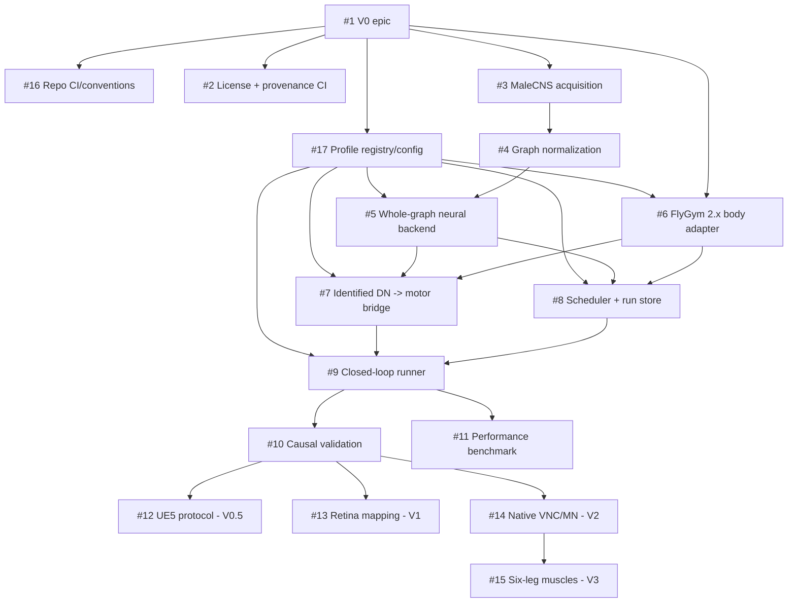

# Initial development backlog

GitHub issues are the execution source of truth. This document is the architectural dependency map.

## Issue map

| Issue | Scope | Phase |
|---|---|---|
| #1 | V0 epic | V0 |
| #2 | license + scientific provenance gates | V0 |
| #3 | MaleCNS v1.0 acquisition + source hashes | V0 |
| #4 | deterministic graph normalization | V0 |
| #5 | whole-graph MaleCNS neural backend | V0 |
| #6 | FlyGym 2.x / NeuroMechFly body adapter | V0 |
| #7 | identified DN -> locomotion bridge | V0 |
| #8 | multi-clock scheduler + run store + replay | V0 |
| #9 | closed-loop experiment runner + CLI | V0 |
| #10 | causal baseline/ablation/control validation | V0 |
| #11 | canonical performance benchmark | V0 |
| #12 | Core <-> UE5 protocol spike | V0.5 |
| #13 | compound-eye -> MaleCNS visual mapping | V1 |
| #14 | native MaleCNS VNC -> motor-neuron path | V2 |
| #15 | six-leg motor-neuron -> muscle/tendon actuation | V3 |
| #16 | lightweight CI/repository conventions | V0 |
| #17 | typed profile registry + immutable config | V0 |

## V0 critical path

1. #2 license/provenance validation + #16 lightweight repository CI/conventions;
2. #17 typed profile registry and immutable resolved configuration;
3. #3 MaleCNS acquisition;
4. #4 deterministic graph normalization;
5. #5 whole-graph neural backend;
6. #6 FlyGym 2.x body adapter (parallel with #3-#5 once #17 contracts exist);
7. #7 identified descending-neuron motor bridge;
8. #8 authoritative scheduler + run store;
9. #9 closed-loop experiment runner;
10. #10 causal validation suite;
11. #11 performance characterization.

## Post-V0 research

- #12 UE5 viewer protocol and pose mirroring;
- #13 FlyGym ommatidium <-> MaleCNS retinal/optic-column mapping;
- #14 native VNC/motor-neuron output path and body feedback;
- #15 six-leg motor-neuron -> muscle/tendon actuation once #14 and upstream muscle support justify it.
