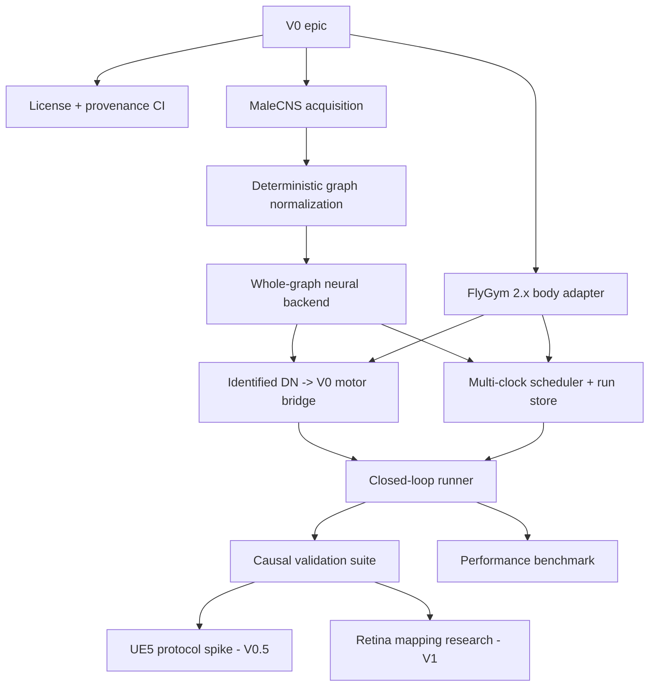

# Initial development backlog

This document gives the intended dependency order. GitHub issues are the execution source of truth; this file is the architectural map.

## V0 critical path

1. license/provenance validation;
2. MaleCNS acquisition;
3. deterministic graph normalization;
4. whole-graph neural backend;
5. FlyGym 2.x body adapter (can run in parallel with 2-4);
6. identified descending-neuron motor bridge;
7. authoritative scheduler + run store;
8. closed-loop experiment runner;
9. causal validation suite;
10. performance characterization.

## Post-V0 parallel research

- UE5 viewer protocol and pose mirroring;
- FlyGym ommatidium <-> MaleCNS retinal/optic-column mapping;
- native VNC/motor-neuron output mapping;
- proprioceptive/contact feedback identity/tuning research.
